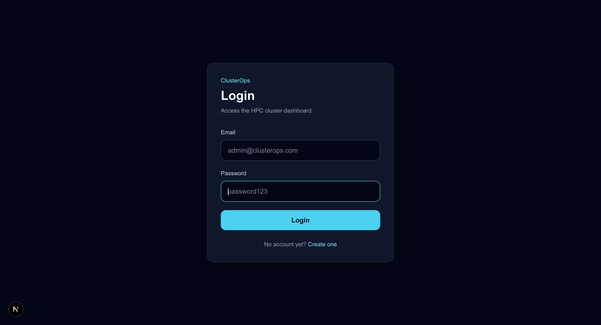
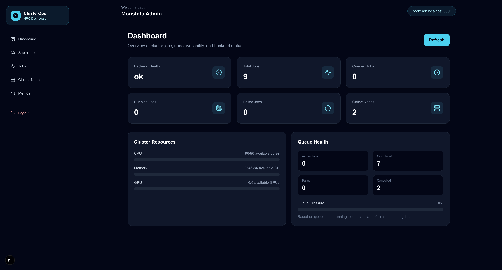
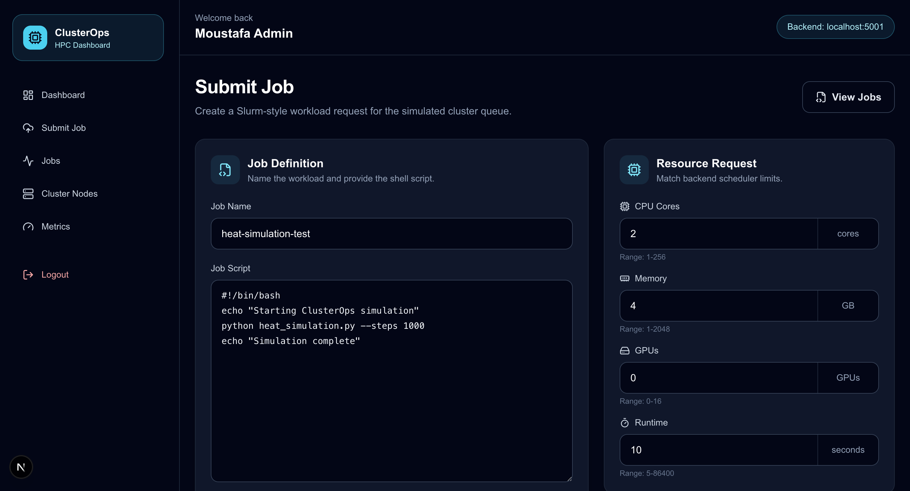
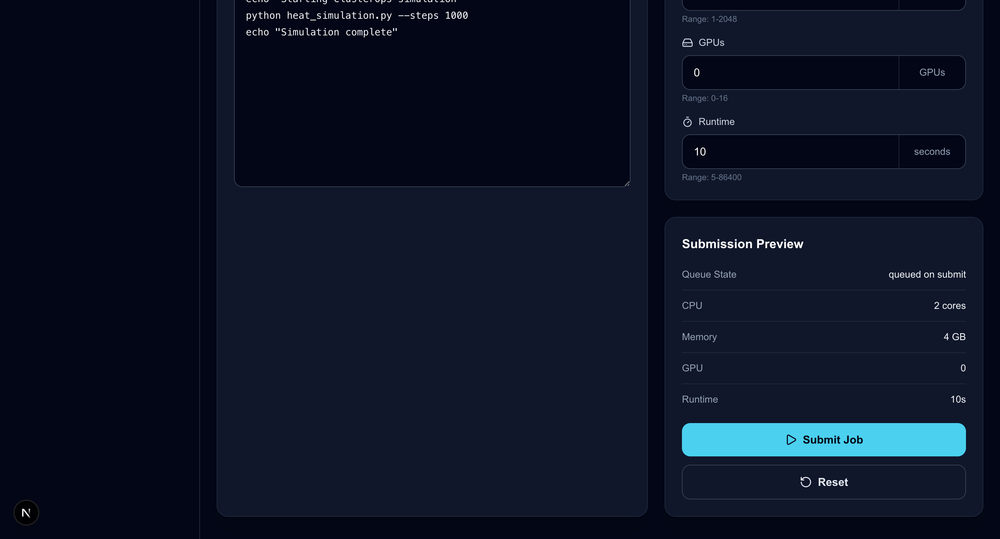
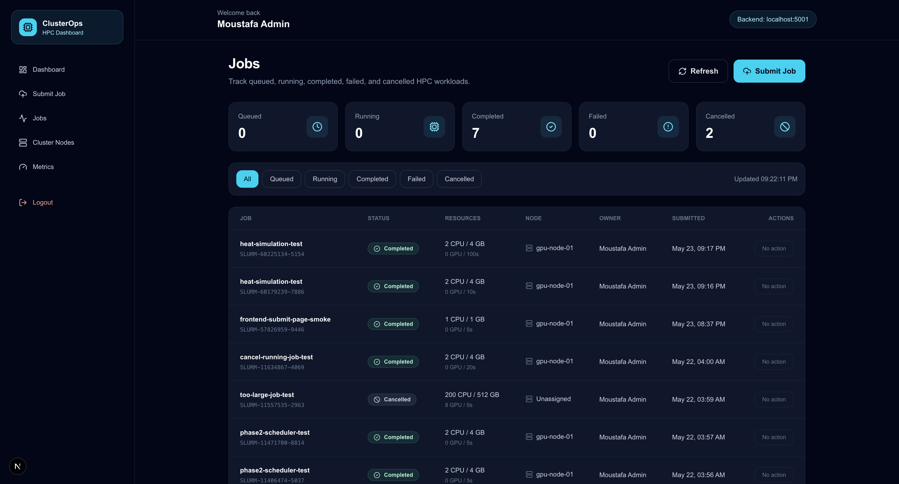
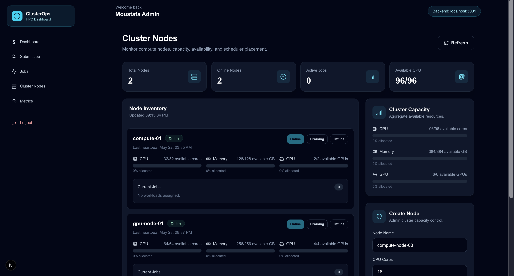
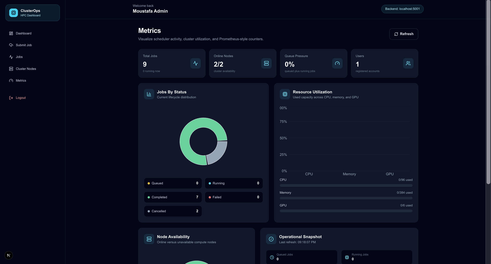
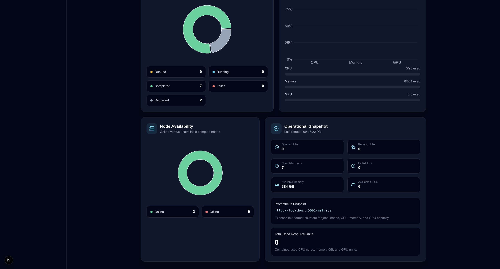

# ClusterOps HPC Dashboard

ClusterOps is a full-stack HPC cluster operations dashboard built as a portfolio project for a Full-Stack Developer role focused on Node.js, React/Next.js, Linux infrastructure, and HPC concepts.

The app simulates a small HPC environment where authenticated users can submit jobs, monitor queue state, inspect compute node capacity, cancel workloads, and view Prometheus-style metrics through a web dashboard.

## Project Purpose

This project connects full-stack web development with HPC operations concepts:

- Node.js/Express backend APIs
- Next.js/React frontend
- MongoDB persistence
- JWT authentication and role-based authorization
- Slurm-inspired job lifecycle simulation
- CPU, RAM, and GPU resource allocation
- Cluster node monitoring
- Prometheus-style metrics endpoint
- Security middleware and operational API structure

It is designed to show practical understanding of both web application engineering and HPC scheduler workflows.

## Features

- User registration and login
- JWT-protected dashboard pages
- Submit HPC-style jobs with script, CPU, memory, GPU, and runtime requests
- Automatic scheduler simulation for job state transitions
- Job queue table with status filters and cancel actions
- Compute node inventory with resource availability meters
- Admin-only node creation and node status updates
- Dashboard overview for backend health, jobs, and cluster resources
- Metrics page with charts for job status, node availability, and resource usage
- Prometheus-compatible `/metrics` endpoint
- Audit logging for important backend actions

## Tech Stack

### Frontend

- Next.js
- React
- TypeScript
- Tailwind CSS
- Axios
- lucide-react
- Recharts

### Backend

- Node.js
- Express.js
- TypeScript
- MongoDB
- Mongoose
- JWT
- bcrypt
- Zod
- Helmet
- CORS
- express-rate-limit
- Morgan

### HPC / Ops Concepts

- Slurm-style job submission
- Queue lifecycle: `queued -> running -> completed`
- Failure and cancellation states
- CPU/RAM/GPU resource reservation
- Node availability and draining/offline states
- Prometheus-style metrics
- API-first backend design

## Architecture

```text
Browser
  |
  | Next.js / React UI
  v
Frontend: http://localhost:3000
  |
  | Axios API calls with JWT bearer token
  v
Backend: http://localhost:5001
  |
  | Mongoose
  v
MongoDB: mongodb://127.0.0.1:27017/clusterops

Backend services:
  - Auth service
  - Job service
  - Scheduler service
  - Slurm simulator service
  - Node service
  - Metrics service
  - Audit service
```

## Job Lifecycle

ClusterOps simulates a scheduler similar to a simplified Slurm queue.

```text
queued -> running -> completed
queued -> running -> failed
queued -> cancelled
running -> cancelled
```

When a user submits a job:

1. The backend stores the job as `queued`.
2. The scheduler checks online nodes for enough CPU, memory, and GPU capacity.
3. If capacity exists, the job becomes `running`.
4. The selected node reserves the requested resources.
5. A simulated Slurm job ID is generated.
6. After the simulated runtime, the job becomes `completed` or `failed`.
7. Reserved node resources are released.
8. Metrics update automatically.

Jobs requesting more resources than the cluster can provide remain queued.

## HPC Concepts Demonstrated

ClusterOps demonstrates core HPC operations concepts through a safe local simulation.

### Slurm-Style Job Submission

Users submit jobs with a shell script, CPU count, memory requirement, GPU requirement, and estimated runtime. The backend assigns each job a simulated Slurm job ID.

### Queue Lifecycle

Jobs move through realistic scheduler states:

```text
queued -> running -> completed
queued -> running -> failed
queued -> cancelled
running -> cancelled
```

### Resource Scheduling

The scheduler only starts a job when an online compute node has enough available CPU, memory, and GPU capacity.

### Node Resource Reservation

When a job starts, the assigned node reserves the requested resources. When the job completes, fails, or is cancelled, those resources are released back to the node.

### Cluster Node States

Compute nodes can be marked as:

```text
online
draining
offline
```

This models basic cluster operations behavior where nodes may be available, being prepared for maintenance, or unavailable.

### Prometheus-Style Metrics

The backend exposes a `/metrics` endpoint with text-format counters for jobs, nodes, CPU, memory, and GPU capacity.

### Operational Dashboarding

The frontend translates backend scheduler and cluster state into dashboards for queue health, resource utilization, node availability, and job outcomes.

## Screenshots

### Login



### Dashboard



### Submit Job





### Jobs Queue



### Cluster Nodes



### Metrics





## Local Development

### Prerequisites

- Node.js
- npm
- MongoDB running locally

MongoDB should be available at:

```text
mongodb://127.0.0.1:27017/clusterops
```

### 1. Clone the Repository

```bash
git clone <your-repo-url>
cd clusterops-hpc-dashboard
```

### 2. Configure Backend Environment

Create `backend/.env`:

```env
PORT=5001
MONGO_URI=mongodb://127.0.0.1:27017/clusterops
JWT_SECRET=clusterops_super_secret_dev_key_2026_change_later
JWT_EXPIRES_IN=7d
NODE_ENV=development
CLIENT_URL=http://localhost:3000

SCHEDULER_ENABLED=true
SCHEDULER_QUEUE_INTERVAL_MS=3000
SCHEDULER_COMPLETION_INTERVAL_MS=3000
SCHEDULER_MAX_SIMULATED_RUNTIME_MS=5000
SCHEDULER_FAILURE_RATE=0
```

Do not commit `.env`.

### 3. Configure Frontend Environment

Create `frontend/.env.local`:

```env
NEXT_PUBLIC_API_URL=http://localhost:5001
```

### 4. Install Dependencies

Backend:

```bash
cd backend
npm install
```

Frontend:

```bash
cd ../frontend
npm install
```

### 5. Start the Backend

```bash
cd backend
npm run dev
```

Expected output:

```text
MongoDB connected
ClusterOps backend running on http://localhost:5001
ClusterOps scheduler started
```

### 6. Start the Frontend

```bash
cd frontend
npm run dev
```

Open:

```text
http://localhost:3000
```

## Demo Login

If you already created the local admin user, log in with:

```text
email: admin@clusterops.com
password: password123
```

If not, use the Register page and create an admin account.

## API Overview

### Health

```text
GET /health
```

### Auth

```text
POST /api/auth/register
POST /api/auth/login
GET  /api/auth/me
```

### Jobs

```text
GET   /api/jobs
POST  /api/jobs
GET   /api/jobs/:id
PATCH /api/jobs/:id/cancel
```

### Nodes

```text
GET   /api/nodes
POST  /api/nodes
PATCH /api/nodes/:id/status
```

### Metrics

```text
GET /api/metrics/overview
GET /metrics
```

### Scheduler

```text
GET  /api/scheduler/status
POST /api/scheduler/tick
```

### Admin

```text
GET /api/admin/users
GET /api/admin/audit-logs
```

## Example API Flow

Login:

```bash
curl -X POST http://localhost:5001/api/auth/login \
  -H "Content-Type: application/json" \
  -d '{
    "email": "admin@clusterops.com",
    "password": "password123"
  }'
```

Submit a job:

```bash
curl -X POST http://localhost:5001/api/jobs \
  -H "Content-Type: application/json" \
  -H "Authorization: Bearer YOUR_TOKEN" \
  -d '{
    "jobName": "heat-simulation-test",
    "script": "#!/bin/bash\necho Starting simulation\npython heat_simulation.py --steps 1000\necho Done",
    "cpus": 2,
    "memoryGb": 4,
    "gpus": 0,
    "estimatedRuntimeSeconds": 10
  }'
```

List jobs:

```bash
curl http://localhost:5001/api/jobs \
  -H "Authorization: Bearer YOUR_TOKEN"
```

Prometheus metrics:

```bash
curl http://localhost:5001/metrics
```

## Frontend Pages

```text
/              Landing page
/login         Login
/register      Register
/dashboard     Cluster overview
/submit-job    Job submission form
/jobs          Job queue and cancellation
/nodes         Cluster node monitoring and admin controls
/metrics       Charts and Prometheus endpoint reference
```

## Security Notes

The backend includes:

- Password hashing with bcrypt
- JWT authentication
- Role-based authorization
- Helmet security headers
- CORS configuration
- Rate limiting
- Zod request validation
- Centralized error handling

This is still a development portfolio project. Production deployment would require stronger secret management, HTTPS, hardened CORS, logging/monitoring, and infrastructure-level security controls.

## Current Status

Completed:

- Backend API foundation
- Auth and role middleware
- MongoDB models
- Scheduler simulation
- Job submission and cancellation
- Node monitoring and admin controls
- Dashboard metrics
- Prometheus-style metrics endpoint
- Next.js frontend pages
- Protected frontend layout

Planned:

- Docker Compose for frontend, backend, and MongoDB
- Nginx reverse proxy
- Prometheus and Grafana services
- AWS deployment notes
- More detailed job detail page
- More complete admin dashboard

## Resume Bullets

- Built a full-stack HPC cluster dashboard with a Node.js/Express TypeScript backend, MongoDB persistence, JWT authentication, role-based access control, and a Slurm-inspired scheduler simulation.
- Developed a Next.js/React dashboard for authenticated users to submit jobs, monitor queue state, inspect cluster nodes, and view Prometheus-style metrics.
- Implemented CPU/RAM/GPU resource reservation, job cancellation, node status controls, audit logging, and automatic job lifecycle transitions across queued, running, completed, failed, and cancelled states.

## Future Improvements

- Containerize the app with Docker Compose
- Add Nginx as a reverse proxy
- Add Prometheus scraping and Grafana dashboards
- Add AWS deployment guide
- Add CI checks for backend typecheck and frontend lint/build
- Add end-to-end tests for login, job submission, and scheduler transitions
- Add real Slurm adapter interface for future integration

## License

MIT
